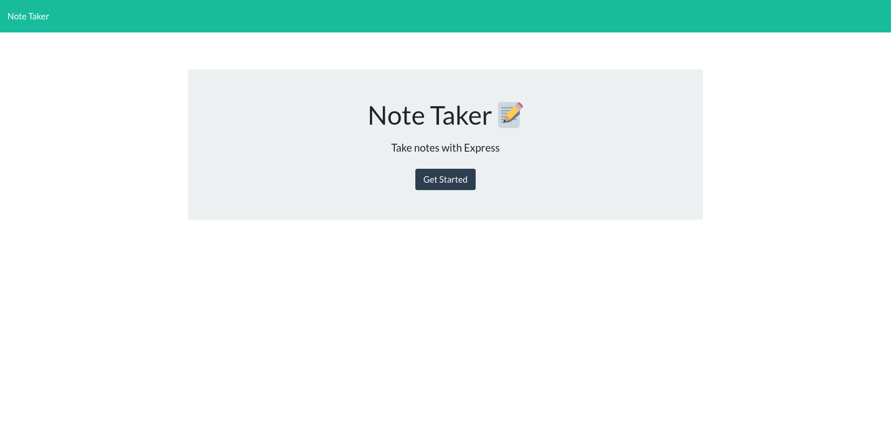
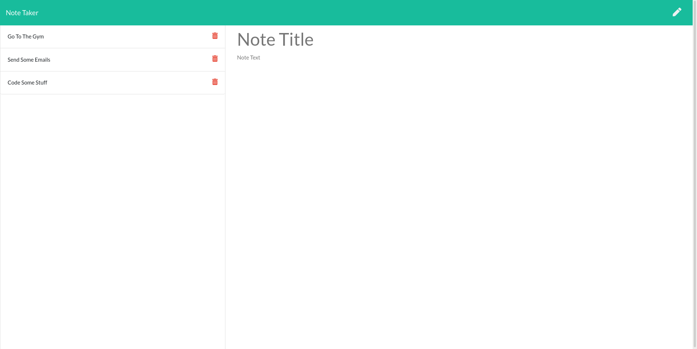
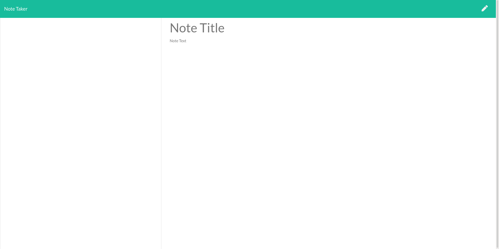
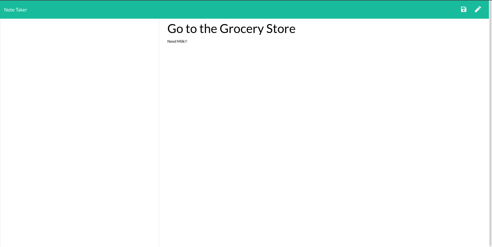
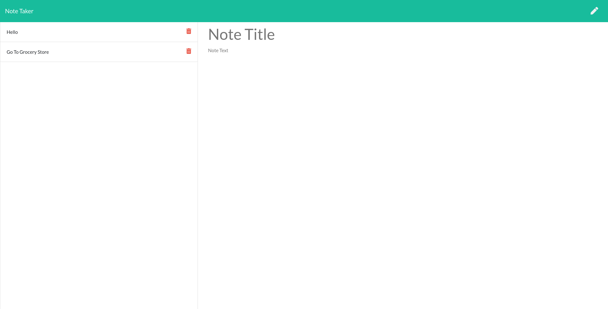
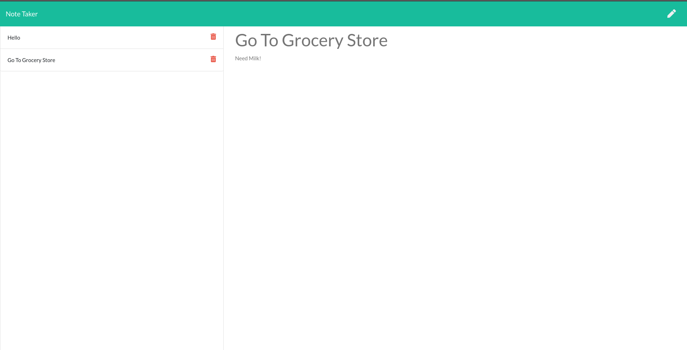

# Express Note Taker Application

## Description
This is a note taking application with its backend built out using express.js.

## Installation
To install the application locally

1. Clone the Repo into your local machine. The Repository can be found [here](https://www.github.com/thebadams/note-taker-app.git)
1. Run <code>npm install</code> in the same directory as the package.json
1. This command should install express and enable you to run the server on PORT 8080.

## Usage

You can run the application one of two ways:

1. Going to the deployed application, which can be found at [this link](https://fast-dusk-92728.herokuapp.com/).

1. Once the application's files and dependencies have been installed to the local machine, you can run start the server by running <code>npm start</code>, or alternatively, <code>node server.js</code>.
  
   1. This should start the server on PORT 8080 of localhost.

1. Once the server has been started, you venture to the application by going to the [deployed application](https://fast-dusk-92728.herokuapp.com/) or by going to http://localhost:8080 in your web browser of choice. 

1. When you go to the deployed application, you will be greeted with the following view:

    

1. Next, Click on the "Get Started" button. It should take you to the next page, which should look like this if there are notes:
    

1. Or it should look like this if there are no notes at the moment:
    .
    

1. By clicking on the pencil icon, you will be able to add a new note. You Will Then be able to save the note by clicking the save icon:

    

    

1. By Clicking on a note on the left, you will be able to view its entirety in the active notes section to the right:

    

## Contact and Contibute

My Github is found at the following [link](https://www.github.com/thebadams)

You can contact me via email at [bpeteradams@gmail.com](mailto:bpeteradams@gmail.com)

Contribute by viewing and forking the [repo](https://www.github.com/thebadams/note-taker-app.git).

## License

MIT License

Copyright (c) 2021 Brian P. Adams

Permission is hereby granted, free of charge, to any person obtaining a copy
of this software and associated documentation files (the "Software"), to deal
in the Software without restriction, including without limitation the rights
to use, copy, modify, merge, publish, distribute, sublicense, and/or sell
copies of the Software, and to permit persons to whom the Software is
furnished to do so, subject to the following conditions:

The above copyright notice and this permission notice shall be included in all
copies or substantial portions of the Software.

THE SOFTWARE IS PROVIDED "AS IS", WITHOUT WARRANTY OF ANY KIND, EXPRESS OR
IMPLIED, INCLUDING BUT NOT LIMITED TO THE WARRANTIES OF MERCHANTABILITY,
FITNESS FOR A PARTICULAR PURPOSE AND NONINFRINGEMENT. IN NO EVENT SHALL THE
AUTHORS OR COPYRIGHT HOLDERS BE LIABLE FOR ANY CLAIM, DAMAGES OR OTHER
LIABILITY, WHETHER IN AN ACTION OF CONTRACT, TORT OR OTHERWISE, ARISING FROM,
OUT OF OR IN CONNECTION WITH THE SOFTWARE OR THE USE OR OTHER DEALINGS IN THE
SOFTWARE.

